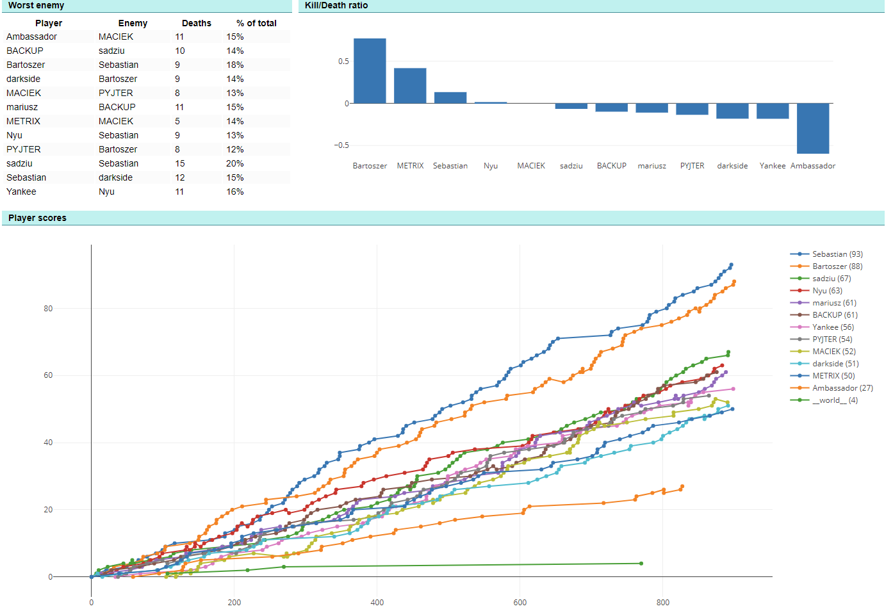

# Quake Stats
Quake 3 logs / Quake Live events processing project.

Allows to retrieve, process, analyze, store and present Quake matches.

The project doesn't aim to give global stats like [qlstats](http://qlstats.net) it's rather meant to store statistics from some server group (server domain). The origins of Quake Stats come from a group of players who occasionally play together and want to keep track of their matches... and to have fun from some custom made medals (badges) :)

### Supported features:
* processing Quake 3 logs (log parsing, at the moment OSP mod only)
* processing Quake Live event streams (zmq listen, needs some work)
* translating (to some extent) Quake 3 logs into Quake Live events
* analysing matches
* storing matches in Database backend (Mongo DB)
* presenting match results through a web application

### Supported mods and game modes
Unfortunately only OSP FFA from Quake 3 is well tested as it was the main use case
#### mods
- [x] - OSP
- [x] - Quake Live - most of event processing is implemented
- [ ] - vanilla Q3 not supported due to missing ServerTime info

#### modes
- [x] - FFA
- [x] - CA (partially tested)
- [ ] - TDM
- [ ] - CTF

### Custom medals
Are described here [resources.js](quakestats/static/js/resources.js)

### Examples
The stats are presented with fancy charts, custom medals, etc. See the examples below.
#### Total badges/medals board

#### Total kills & deaths

#### Single match Kill Death Ratio, Worst Enemy, Score over Time chart


### Requirements
- Decent version of Python 2 or 3
- Local instance of Mongo DB (remote backend not implemented, easy to add)
- Modern web browser (requires css grid-layout)

## How to setup
In order to setup the application you need to have python 2 or 3 (virtualenv recommended) and local instance of mongo DB.

### Configuration
The application is configured by setting ```QUAKESTATS_SETTINGS``` environment variable to path to configuration file.
See example [settings.py](examples/settings.py)

### Launching the application
#### Run in twistd
You can launch Quake Stats web application using ```twistd``` webserver. Just make sure to install twisted framework first.
```bash
FLASK_APP="quakestats.web"; QUAKESTATS_SETTINGS=`pwd`/settings.py; twistd web --wsgi quakestats.web.app
```

### Setup admin user
Admin user is used by web application to access some additional administrative operations. For now it's only setting map sizes. Just to have a list of recently used maps and their sizes. Nothing more at the moment.
You need to run python snippet to generate password.
```python
# import the hash algorithm
from passlib.hash import pbkdf2_sha256

# generate new salt, and hash a password
hash = pbkdf2_sha256.hash("yourpasswordgoeshere")
'$pbkdf2-sha256$29000$N2YMIWQsBWBMae09x1jrPQ$1t8iyB2A.WF/Z5JZv.lfCIhXXN33N23OSgQYThBYRfk'
```
Then use mongo DB shell to inject user info
```
db.user.insert({'username': 'admin', 'password': '$pbkdf2-sha256$29000$N2YMIWQsBWBMae09x1jrPQ$1t8iyB2A.WF/Z5JZv.lfCIhXXN33N23OSgQYThBYRfk'})
```

## How to use
### Uploading Quake 3 log file
In order to process some data you need to send your match log file to web api endpoint ```/api/v2/upload```.
You need an ```ADMIN_TOKEN``` set in configuration.
```bash
curl -X POST --form file=@/path/to/your/games.log --form token=adminsecrettoken host:port/api/v2/upload
```
All log files with extracted matches are stored in directory determined by ```RAW_DATA_DIR``` config entry

### Rebuilding database
You can rebuild your database using files stored in ```RAW_DATA_DIR``` with simple web api call.
```bash
curl -X POST host:port/api/v2/admin/rebuild --form token=adminsecrettoken
```
If you implement some new Medals or any other backend related feature this API call will clear previous data stored in DB and process all matches from data directory once again.

### Merging player results
Unfortunately the only way to distinguish players in Quake 3 servers is to use player nickname. When player changes his nickname between matches he will be treated as new unique player. In such cases admin can merge results of two specific players. Use with caution as it will rewrite history of all matches stored in database.
```bash
curl -X POST host:port/api/v2/admin/players/merge --form token=admintoken --form source_player_id=297f6272f79d4918c4efe098 --form target_player_id=df55e5cd4582d6f14cd20746
```
It will merge all results from player with id ```297f6272f79d4918c4efe098``` into player with id ```df55e5cd4582d6f14cd20746```. To find out how player ID is build see the development section.

## Development

### Tech stack
Python, Flask, MongoDB, d3.js, riot.js, zmq

### Building blocks
There are several 'responsibility bound' components

#### Dataprovider
Groups logic related to gathering data (logs, events), processing and analysis.

##### How does it work with Quake 3 Players
Quake 3 players don't have unique ID's so it's hard to distinguish players between matches. In order to overcome this problem each player has ```player_id``` assigned during match analysis. The ID is constructed as hash of ```SERVER_DOMAIN``` and player nickname as a result it's consistent between matches as long as player keeps his nickname and there is no nickname clash. Perhaps there is some better way? Server side auth?

#### Datasource
Groups logic related to storage backend and storage related operations

#### Web
Web application related components
- api - web API used by frontend and to retrieve Quake 3 logs
- views - typical flask views


#### Data flow
```
# Data gathering
Quake Live Data	(events) -> QLMatchFeeder >-------|
                                                  |----> Data Preprocessor (FullMatchReport)
Quake 3 Data (log) -> Q3MatchFeeder -> Q3toQL >---|

# Data procesing
Data Preprocessor (FullMatchReport) -> Data Analyzer (AnalysisResult)

# Data storage
Data Analyzer (AnalysisResult) -> StorageApi -> StorageBackend
```

#### Web data flow
```
Stats webapp ----| -> Web API -> StorageApi -> StorageBackend
```
### Extending
#### How to add new medal
- see [SpecialScores class](quakestats/dataprovider/analyze.py#L67) - for special scores
- see [Badger class](quakestats/dataprovider/analyze.py#L484) - for badges calculation
- see [JS resources](quakestats/static/js/resources.js) - to add new medal image

#### Running tests
```bash
make test
```
### Assets
Medals, icons, etc.
Some of the assets are missing it would be nice to find some free ones or draw them ;)

### TODO
- [ ] Add support for listening to Quake Live event publisher, minor work needed
